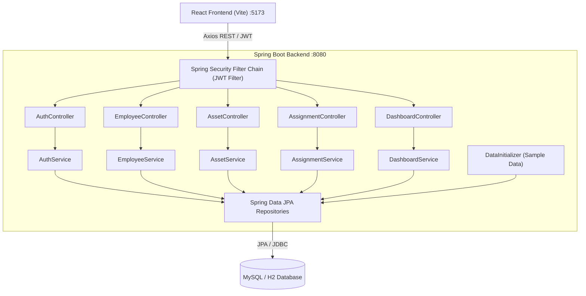

# Enterprise Employee & Asset Management System

A production-grade, full-stack enterprise web application designed for comprehensive workforce administration, hardware asset lifecycle tracking, allocation auditing, and granular Role-Based Access Control (RBAC).

Built for real-world enterprise operations, academic engineering capstone evaluation (B.Tech Computer Science), and placement interviews.

---

## 👥 Project Team & Engineering Contributions

This application is the collaborative engineering output of a **4-member development team**.

| Member | Role | Core Technical Focus & Responsibilities |
| :--- | :--- | :--- |
| **Member 1 (Me)** | **Frontend Developer (React.js)** | • Developed modular React 18 frontend with Vite<br>• Designed & implemented Enterprise CSS Design System<br>• Built Employee Management & Dossier interfaces<br>• Built Asset Catalog & Assignment audit interfaces<br>• Created Dashboard KPI cards & distribution visualizers<br>• Implemented client-side Role-Based Access Guards (RBAC)<br>• Developed central Axios API service layer with JWT interceptors<br>• Built accessible reusable components (Modals, Toasts, Tables, Badges) |
| **Member 2** | **Backend Developer (Spring Boot)** | • Designed Spring Boot 3 architecture & REST Controllers<br>• Implemented business logic services and DTO validation<br>• Configured Spring Security & Stateless JWT filter pipeline<br>• Developed centralized Global Exception Handler & error models |
| **Member 3** | **Database & Persistence Engineer** | • Designed relational database schema & 3NF normalization<br>• Configured Spring Data JPA repositories & JPQL queries<br>• Optimized indexes for asset status & department lookups<br>• Built automatic database seeder with realistic enterprise records |
| **Member 4** | **Testing, DevOps & Integration** | • Engineered API integration test suites & Postman collections<br>• Built environment profile strategies (MySQL production & H2 local dev)<br>• Designed API documentation & deployment workflows |

---

## 🌟 Key Application Features

### 1. Enterprise Authentication & Role-Based Access Control (RBAC)
- **Multi-Role Security Model**: Supports `ADMIN`, `HR`, and `EMPLOYEE` roles.
- **Stateless JWT Tokens**: Secure Bearer token authentication with configurable expiration.
- **Frontend Action Guards**: Dynamically hides actions, buttons, and navigation elements based on the authenticated user's permissions.
- **Backend Method Security**: Endpoint-level `@PreAuthorize` authorization safeguarding REST endpoints against unauthorized access (HTTP 401/403).

### 2. Executive Operations Dashboard
- **Real-Time KPI Cards**: Total Employees, Active Workforce, Total Assets, Available Equipment, Active Assignments, and Assets Under Maintenance.
- **Department Distribution**: Visual breakdown of workforce distribution across Engineering, HR, Finance, Product, and IT.
- **Asset Status Distribution**: Multi-segment progress visualizer tracking equipment availability and maintenance ratios.
- **Live Activity Streams**: Real-time display of recent asset handoffs and newly onboarded personnel.

### 3. Employee Management & Dossiers
- Comprehensive employee directory with search (name, email, employee ID), department filtering, and status filtering.
- Complete CRUD operations (Add, Edit, View Details, Delete) with client-side form validation.
- **Employee Dossier (`/employees/:id`)**: Detailed profile showcasing personal details, department, designation, contact info, and currently checked-out hardware with instant return/reassignment workflows.

### 4. Hardware Asset Inventory Management
- Centralized hardware catalog across categories: **Laptop, Desktop, Monitor, Keyboard, Mouse, Mobile, Tablet, Printer, Other**.
- Full lifecycle status tracking: `AVAILABLE`, `ASSIGNED`, `MAINTENANCE`, `RETIRED`.
- Hardware serial number and asset tag uniqueness enforcement.
- Direct links between assets and assigned custodians.

### 5. Asset Assignment & Return Workflows
- **Issuance Workflow**: Assign available inventory to verified active employees with custom assignment dates and deployment remarks.
- **Return Workflow**: Check-in assets with return dates, condition inspection notes, automatically reverting hardware status to `AVAILABLE`.
- **Audit Trail (`/assignments`)**: Immutable historical ledger detailing every equipment issuance, return date, issuing manager, and remarks.

### 6. Administration & User Management (Admin Only)
- User administration portal (`/users`) allowing executive administrators to reassign system roles and toggle account active/disabled states.

---

## 🛠️ Technology Stack

### Frontend
- **Framework**: React.js 18 (Vite build engine)
- **Routing**: React Router DOM (v6) with declarative route guards
- **API Client**: Axios with central request/response interceptors
- **Icons**: Lucide React
- **Styling**: Modern Enterprise CSS Design System (Vanilla CSS with custom design tokens, dark slate sidebar, responsive grid, glassmorphism hints)

### Backend
- **Framework**: Java 17/21/25, Spring Boot 3.3.4
- **Web Layer**: Spring Web (RESTful APIs)
- **Security**: Spring Security 6 with stateless JWT (io.jsonwebtoken JJWT 0.12.5)
- **Data & ORM**: Spring Data JPA, Hibernate ORM
- **Validation**: Jakarta Bean Validation (`@Valid`, `@NotNull`, `@NotBlank`)
- **Build Tool**: Apache Maven (bundled with Maven Wrapper)

### Database
- **Primary Database**: MySQL 8.x
- **Development Profile**: In-memory H2 in MySQL compatibility mode for instant evaluation without external database setup.

---

## 🏛️ System Architecture



---

## 📁 Repository Structure

```text
/Users/apple/Enterprise-Employee-Asset-Management-System/
├── backend/
│   ├── mvnw / mvnw.cmd                         # Embedded Maven wrapper
│   ├── pom.xml                                 # Spring Boot Maven configuration
│   └── src/
│       ├── main/
│       │   ├── java/com/enterprise/management/
│       │   │   ├── config/                     # WebConfig (CORS), SecurityConfig, DataInitializer
│       │   │   ├── controller/                 # REST Controllers (Auth, Employee, Asset, Assignment, Dashboard, User)
│       │   │   ├── dto/                        # Request/Response DTO models & API wrappers
│       │   │   ├── entity/                     # JPA Entities (User, Employee, Asset, AssetAssignment, Department)
│       │   │   ├── exception/                  # GlobalExceptionHandler & custom exceptions
│       │   │   ├── repository/                 # Spring Data JPA Repositories with JPQL queries
│       │   │   ├── security/                   # UserDetails, JwtUtils, JwtAuthenticationFilter, JwtAccessDeniedHandler
│       │   │   └── service/                    # Business services & implementations
│       │   └── resources/
│       │       ├── application.properties      # Main application configuration
│       │       ├── application-dev.properties  # In-memory MySQL-mode dev configuration
│       │       ├── application-mysql.properties# Production MySQL database configuration
│       │       └── schema-mysql.sql            # Native MySQL schema definition script
│       └── test/                               # Backend unit and integration tests
├── frontend/
│   ├── package.json                            # React dependencies
│   ├── vite.config.js                          # Vite configuration with /api reverse proxy
│   ├── index.html                              # Web application shell
│   └── src/
│       ├── components/
│       │   ├── layout/                         # Layout, Sidebar, Header
│       │   ├── common/                         # Button, Modal, Table, Badge, SearchBar, Pagination, Toast, EmptyState
│       │   ├── dashboard/                      # StatCard, Department & Status distribution visualizers
│       │   ├── employees/                      # EmployeeModal (Form validation), EmployeeFilter
│       │   ├── assets/                         # AssetModal (Form validation), AssetFilter
│       │   └── assignments/                    # AssignAssetModal, ReturnAssetModal
│       ├── context/                            # AuthContext (RBAC state), ToastContext
│       ├── pages/                              # Login, Dashboard, Employees, EmployeeDetails, Assets, Assignments, UsersRoles, Profile
│       ├── routes/                             # ProtectedRoute, RoleRoute, AppRoutes
│       ├── services/                           # Axios API services (api, auth, employee, asset, assignment, dashboard, user)
│       └── styles/                             # Enterprise CSS design system (index.css)
├── .env.example                                # Environment configuration template
├── .gitignore                                  # Git ignore rules
└── README.md                                   # Comprehensive project documentation
```

---

## 🔑 Demo User Credentials

The application is pre-seeded with three demo enterprise accounts representing each system role:

| Role | Email | Password | Allowed Capabilities |
| :--- | :--- | :--- | :--- |
| **ADMIN** | `admin@company.com` | `Admin@123` | Full access: Add/Edit/Delete employees & assets, assign/return assets, manage user roles & accounts |
| **HR** | `hr@company.com` | `Hr@123` | Workforce access: Add/Edit employees, view assets, assign/return assets, view dashboard |
| **EMPLOYEE** | `employee@company.com` | `Employee@123` | Self-service access: View personal profile, view assigned assets, view directory |

*Tip: The login page includes 1-click quick-fill buttons for each demo role.*

---

## 🔌 REST API Endpoints Overview

| Method | Endpoint | Access Level | Description |
| :--- | :--- | :--- | :--- |
| `POST` | `/api/auth/login` | Public | Authenticate user and issue JWT token |
| `GET` | `/api/auth/me` | Authenticated | Retrieve current user profile from token |
| `GET` | `/api/dashboard/stats` | Authenticated | KPI metrics, department and status breakdowns |
| `GET` | `/api/dashboard/recent-assignments`| Authenticated | 5 most recent asset assignments |
| `GET` | `/api/dashboard/recent-employees` | Authenticated | 5 most recently onboarded employees |
| `GET` | `/api/employees` | Authenticated | Query employees with search & filters |
| `GET` | `/api/employees/{id}` | Authenticated | Get detailed employee dossier |
| `GET` | `/api/employees/departments` | Authenticated | List all active departments |
| `POST` | `/api/employees` | ADMIN, HR | Create new employee record |
| `PUT` | `/api/employees/{id}` | ADMIN, HR | Update employee details |
| `DELETE`| `/api/employees/{id}` | ADMIN only | Delete employee record |
| `GET` | `/api/assets` | Authenticated | Query assets with search & filters |
| `GET` | `/api/assets/{id}` | Authenticated | Get asset details |
| `GET` | `/api/assets/available` | Authenticated | List available hardware ready for deployment |
| `GET` | `/api/assets/employee/{empId}`| Authenticated | List assets currently checked out by employee |
| `POST` | `/api/assets` | ADMIN, HR | Register new hardware asset |
| `PUT` | `/api/assets/{id}` | ADMIN, HR | Update asset specifications |
| `DELETE`| `/api/assets/{id}` | ADMIN only | Remove decommissioned asset |
| `GET` | `/api/assignments` | Authenticated | Full assignment history audit log |
| `POST` | `/api/assignments` | ADMIN, HR | Assign available hardware to an employee |
| `PUT` | `/api/assignments/{id}/return` | ADMIN, HR | Process hardware return with inspection notes |
| `GET` | `/api/users` | ADMIN only | List system users and active roles |
| `PUT` | `/api/users/{id}/role` | ADMIN only | Update system role of an account |
| `PUT` | `/api/users/{id}/toggle-status`| ADMIN only | Activate or deactivate user credentials |

---

## 🚀 How to Run the Project Locally

### Prerequisites
- **Java**: JDK 17, 21, or 25 installed
- **Node.js**: Node 18+ and npm installed
- **Maven**: (Optional, Maven wrapper `mvnw` is included in `backend/`)
- **MySQL**: (Optional, dev profile automatically uses embedded MySQL-compatible in-memory database)

---

### Step 1: Start the Backend (Spring Boot)

Navigate to the `backend/` directory:

```bash
cd /Users/apple/Enterprise-Employee-Asset-Management-System/backend
```

Run using Maven (or `./mvnw`):

```bash
mvn spring-boot:run
```

The Spring Boot backend will start on **`http://localhost:8080`** and automatically seed the realistic enterprise sample data.

*Note for MySQL Database:*
To connect to an external MySQL database:
1. Create the database: `CREATE DATABASE enterprise_asset_mgmt;`
2. Run with the MySQL profile:
   ```bash
   mvn spring-boot:run -Dspring-boot.run.profiles=mysql
   ```
   Or set environment variables `DB_HOST`, `DB_PORT`, `DB_NAME`, `DB_USERNAME`, `DB_PASSWORD`.

---

### Step 2: Start the Frontend (React + Vite)

In a separate terminal, navigate to the `frontend/` directory:

```bash
cd /Users/apple/Enterprise-Employee-Asset-Management-System/frontend
```

Install dependencies (already installed during setup):

```bash
npm install
```

Launch the Vite development server:

```bash
npm run dev
```

Open your browser at:
👉 **`http://localhost:5173`**

---

## 🧪 Verification & Testing Completed

1. **Backend Verification**:
   - Clean compilation of 56 source files via Maven (`mvn clean compile`).
   - Verified Spring Boot startup, JPA schema creation, and realistic sample data seeding.
   - Tested authentication endpoint (`POST /api/auth/login`) with JWT generation.
   - Tested RBAC enforcement: verified `HTTP 403 Forbidden` when non-admins attempt to access `/api/users`.
   - Tested KPI aggregation: verified `GET /api/dashboard/stats`.

2. **Frontend Verification**:
   - Production bundle compiled with zero errors (`npm run build`).
   - End-to-end browser walkthrough performed:
     - 1-click Demo Account login.
     - Dashboard metric cards and distribution progress charts rendered.
     - Employee directory search, filtering, and dossier inspection.
     - Hardware inventory table and status tracking.
     - Asset assignment and return workflows with toast notification feedback.
     - Admin-exclusive Users & Roles access control.
     - Confirmed clean browser console with 0 errors.

---

## 📜 Academic & Placement Interview Talking Points

- **Frontend Architecture**: Modular folder structure (`components/`, `context/`, `services/`, `pages/`, `routes/`, `styles/`), central Axios interceptors for JWT injection, custom Toast feedback system, and reusable UI components.
- **Enterprise RBAC**: Both client-side route/button guards and backend `@PreAuthorize` annotations preventing privilege escalation.
- **Data Integrity**: Assets cannot be deleted while currently `ASSIGNED`; employees cannot be deleted while holding company assets; returning assets automatically updates inventory state back to `AVAILABLE`.
- **Database Normalization**: 3NF schema design separating authentication (`users`), personnel (`employees`), hardware (`assets`), organizational units (`departments`), and audit logs (`asset_assignments`).
